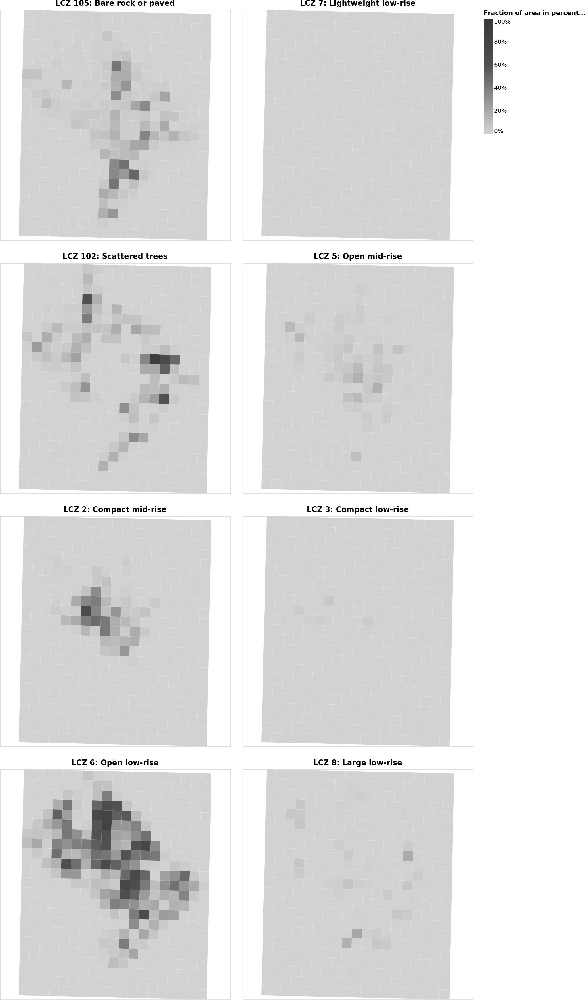
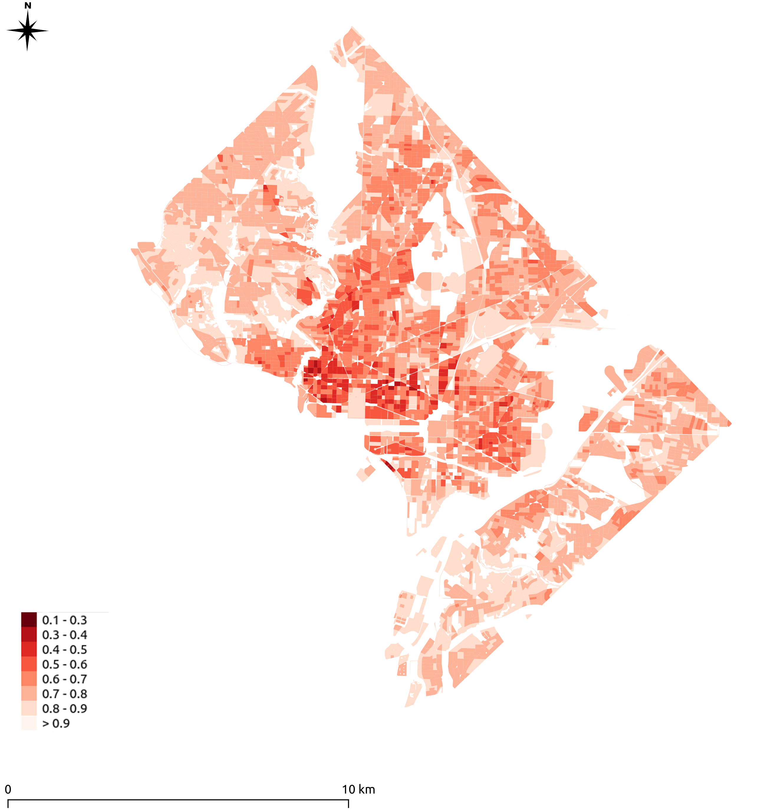
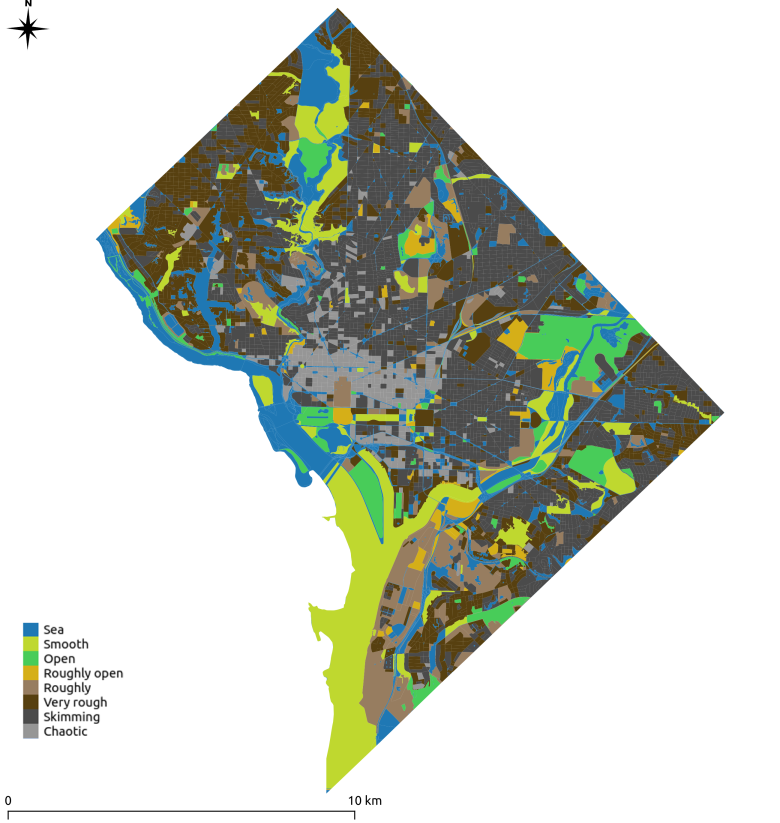
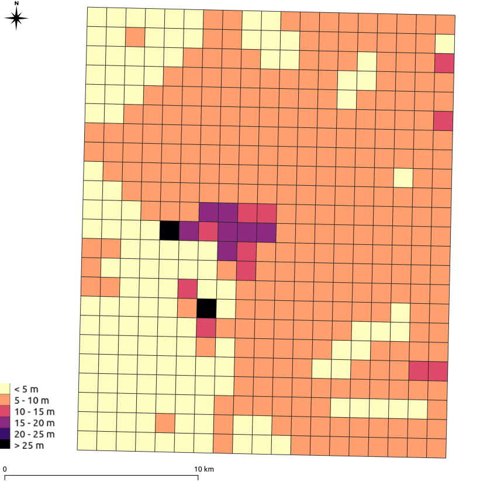

# Summary

Human activities induce changes on land use and land cover. These changes are most significant in urban areas where topographic features (e.g. building, road) affect the density of impervious surface areas and introduce a range of urban morphological patterns. Those characteristics impact the energy balance and modify the climate locally (e.g. inducing the so-called Urban Heat Island phenomenon).

GeoClimate provides georeferenced morphological indicators as well as urban classifications (such as Local Climate Zones) that can be used as climate models inputs and/or to build maps of some of the environmental characteristics of a territory (vegetation fractions, main building forms, main wall directions, density of isolated areas, etc.). GeoClimate can therefore be used for other diagnostic or planning purposes than climate issue: studying the territory fragmentation, the influence of the urban fabric on pollution (noise or air chemical transport), the energy consumption, etc. GeoClimate is available as a free and open source geospatial software. 

# Statement of need

Urban spatial properties are useful to study the urban climate: (i) basic parameters such as building fraction or building height are needed as input of parametric urban climate models such as the Town Energy Balance [^teb] [@masson2000], (ii) more sophisticated ones are clearly correlated to urban climate observations [^obs] and (iii) local climate classifications, useful for international comparisons, are mostly defined from urban spatial properties [@stewart2012]. Thus there is a need for tools dedicated to the calculation of urban spatial metrics.

In previous researches, scripts were developed to automatically calculate numerous indicators useful for urban climate applications [@bocher2018]. These scripts have been organized, improved and have been implemented within a Groovy library called GeoClimate. New urban properties and classifications algorithms have been added. GeoClimate also simplifies the access to geospatial data since it automatically downloads and organizes data from the world-wide OpenStreetMap database [^osm]. One of the current major limitations for the climate community to use this data is its lack of building height information [@masson2020]. Thus we have also added an algorithm to roughly estimate the height of each building missing this information.

This tool is first dedicated to urban climate researchers for modeling purpose: the output of GeoClimate can be directly used by urban climate models or by simple empirical models [@bernard2017]. It is also useful for any investigation dealing with urban climate issues (the calculation of the Local Climate Zone is for example of major interest as metadata for any urban climate study). The indicators calculated by GeoClimate can also be used for territory diagnostic and planning purpose for any spatial related question (climate, energy, biodiversity, pollution, socio-economy, etc.).

# State of the field and features comparison

There is currently no software specifically designed for the calculation of geospatial indicators dedicated to urban climate. However, two softwares can currently be used to automatically perform some of the GeoClimate’s features:

- Urban Multi-Scale Environment Predictor [^umep], available as a plugin in the free and open-source QGIS software, can be used for a variety of applications related to outdoor thermal comfort, urban energy consumption, climate change mitigation [@lindberg2018]
- Local Climate Zone Generator [^lczgen] (LCZ Generator), available as an online tool, produces the LCZ classification of a given area [@demuzere2021].

Table 1 shows the features covered by GeoClimate and for each feature the differences with UMEP and LCZ Generator.

| Geoclimate features                                          | Differences with UMEP                                        | Differences with LCZ Generator                               |
| ------------------------------------------------------------ | ------------------------------------------------------------ | ------------------------------------------------------------ |
| Import data from world-wide database (OSM) as GIS layers: buildings, roads, railways, water, vegetation, impervious | Only the building layer footprint and height are retrieved   | Not performed                                                |
| Estimate the height of building when missing                 | Building height is left to *Not a Number* when missing       | Not performed                                                |
| Calculate building indicators                                | Not performed                                                | Not performed                                                |
| Calculate block indicators                                   | Not performed                                                | Not performed                                                |
| Calculate indicators at two Reference Spatial Unit (RSU) scales:  (i) Topographical Spatial Unit (TSU) (vector format) (ii) Rectangular based grid scale (raster format) | (i) Only few indicators are calculated (ii) Calculations and results are available only at raster scale | Not performed                                                |
| Classify the urban fabric to LCZ                             | Not performed                                                | (i) Need a training area generated by the user (ii) Only available as raster image format |
| Classify the buildings to Urban Typology by Random Forest (UTRF) | Not performed                                                | Not performed                                                |

Table 1: GeoClimate features description and differences with similar commonly-used tools

# Processing steps

GeoClimate performs indicators computation at three spatial unit scales, a spatial unit being a POLYGON or MULTIPOLYGON geometry:

1. Building scale, defined as a collection of features represented by 2.5 geometries with attributes as measures for walls and roof, 
2. Block scale, defined as a set of buildings touching each other (at least one point in common) or as an isolated building, 
3. Reference Spatial Unit (RSU) scale, being the elementary unit to characterize all the characteristics of a piece of land (not only related to buildings but also to vegetation, water). 

The indicators in GeoClimate are calculated from vector GIS layers that represent the main topographic features: zone layer, building layer, road layer, railway layer, vegetation layer, water layer and impervious layer (depending on the use of GeoClimate, only some of the inputs may be needed). To guarantee the use of the algorithms and their outputs, the GIS layers must follow a set of specifications. These specifications are defined for each layer. They include notably the name and the datatype of the columns, the values used by the attributes, the dimension of the geometry.

GeoClimate output data consists in both a set of indicators and classifications. GeoClimate uses the concept of Workflow to chain a set of spatial analysis and statistical processes. The Workflow is organized in 3 steps (\autoref{fig:processing_steps}). Each step or each process within a step can be run individually. A Workflow can be used even if not all input data are provided: partitioning and indicators calculations will then be limited to the supplied data.

{ width=100% }

The first step of the GeoClimate chain concerns the construction of two new spatial units (block and RSU). In the default case described here, Topographical Spatial Units (TSU) are used as RSU. They are defined as a continuous and homogeneous way to divide the space using topographic constraints based on road and railway center lines, vegetation and water surface boundaries, administrative boundaries. Only 2D is considered for partitioning, therefore underground elements (such as tunnels), or overground (such as bridges) are excluded from the input. Water and vegetation surfaces are also not considered for partitioning when they are smaller than a certain threshold, set by default to 2,500 m² for water and 10,000 m² for vegetation. 

The second step is the calculation of spatial indicators. GeoClimate indicators are used to measure morphological properties (e.g the form factor) and describe spatial organizations (e.g. distance measurements, patch metrics, shape index, spatial density). They quantify the shape and pattern of urban and landscape structures. The spatial indicators are computed at three scales : building, block and RSU. Buildings are characterized by their location in a geographical space (e.g distance to the nearest road, average distance to other buildings, number of building neighbors). Building and blocks are characterized by morphological indicators (e.g. a form factor), RSU are characterized by fractions of land type (e.g. vegetation, water, impervious fractions) and specific climate-oriented indicators (e.g. aspect ratio, mean sky view factor). Some of the building indicators are also aggregated at block scale (e.g. mean block height) and some of the building and block indicators are aggregated at RSU scale (e.g. mean number of neighbors per building, mean building height). In the end, more than 100 indicators are calculated[^indicators].

At the third step, classifications use the spatial indicators at the three scales and specific statistical models / algorithms to calculate Urban Typology by Random Forest (UTRF) [@bocher2018] and LCZ at RSU scale. 

The indicators can also be calculated for each cell of a rectangular grid and the result of the classification at TSU scale can be rasterized according to the same grid (\autoref{fig:LCZ_TSU} and \autoref{fig:LCZ_grid}).

{ width=100% }

{ width=100% }

# Coding implementation

GeoClimate algorithms are implemented as functions in Groovy scripts. GeoClimate is organized in 3 modules: GeoIndicators, OSM and BDTopo_V2 (\autoref{fig:modules}).

GeoIndicators is the main module. It contains all the algorithms to build the units of analysis, compute the corresponding indicators and classify urban fabric by type. The SpatialUnits script creates the units of analysis (currently blocks and TSU). The BuildingIndicators, BlockIndicators, RoadIndicators, RSUIndicators scripts calculate morphological and topographical indicators respectively at building, block, road and RSU scales. The GenericIndicators script calculates indicators which can be applied to any scale (e.g. the area of a unit - building, block, RSU - or the aggregation of indicators from one scale to an other - mean building height within a block or a RSU). The TypologyClassification script classifies units to a certain type (currently building to UTRF and TSU to LCZ) based on indicators values. The DataUtil script facilitates data handling (e.g. join several tables). All functions contained in the previous scripts may be called individually. To run several of them in a row, workflows are available in the WorkflowGeoIndicators script. The main one performs all the analysis (green arrows on \autoref{fig:modules}): it produces the units of analysis, computes the indicators at the base scales (building and road), computes indicators at block scale, aggregates indicators from lower to upper scales, computes indicators at RSU scale and then classifies urban fabric.

The OSM module extracts and transforms the OSM data to the GeoClimate abstract model. Those data processings are specified in the two scripts InputDataLoading and InputDataFormating. The WorkflowOSM script chains algorithms (blue arrow \autoref{fig:modules}): it triggers the 2 scripts dedicated to the OSM data preparation and then the WorkflowGeoIndicators script. It is the main entry to specify the area to be processed, the indicators and the classifications to compute.

BDTopo_V2 module follows the same logic as the OSM module, except that it is dedicated to version 2.2 of the French IGN BDTopo database[^ign].

{ width=100% }

# A minimal example

GeoClimate can be executed directly in a command prompt or using the Groovy Console. In the following example, the GeoClimate OpenStreetMap chain is used through the command prompt to calculate TEB inputs, LCZ and UTRF classification for Washington DC taken as an area of interest. 

After downloading the archive Geoclimate.jar and opening a command prompt in the same directory, the script can be called as:

```bash
java -jar GeoClimate.jar -f configuration_file.json -w OSM
```

The f option is used to set the path of the configuration file and the w option to specify the workflow type (OSM or BDTopo_V2).

The configuration file sets the main parameters of the calculation, e.g.:

```groovy
{
    "description": "Processing OSM data for the Washington DC area",
    "input": {
        "osm": [
            "Washington DC"
        ]
    },
    "output": {
        "folder": "/tmp"
    },
    "parameters": {
        "rsu_indicators": {
            "indicatorUse": [
                "LCZ",
                "TEB",
                "UTRF"
            ],
            "svfSimplified": true,
            "estimateHeight": true
        },
        "grid_indicators": {
           	    "x_size": 1000,
	    "y_size": 1000,
	    "indicators" :[
                 "BUILDING_FRACTION", 
                 "BUILDING_HEIGHT", 
                 "WATER_FRACTION",
                 "VEGETATION_FRACTION", 
                 "ROAD_FRACTION", 
                 "IMPERVIOUS_FRACTION", 
                 "LCZ_FRACTION"
             ]
         }
    }
}
```

The configuration file is structured in four main parts.

- "description" is a text that describes the process.  
- "input" specifies the input data. In this example, the OpenStreetMap chain is run for Washington DC.
- "output" specifies the expected format (here "folder") and path (here "/tmp").
- "parameters" specifies the calculated parameters based on  reference spatial units ("rsu_indicators") and then rasterized using a grid ("grid_indicators"). 
  - At RSU scale, the LCZ, the TEB inputs and the UTRF are calculated 	("indicatorUse": ["LCZ", "TEB", 	"UTRF"]). A simplified method is used to calculate the 	sky view factor ("svfSimplified": true) and the method to 	estimate the height of buildings in OSM ("estimateHeight" 	: true).
  - With the grid approach, the grid dimensions in meters are specified 	("x_size" and "y_size")). Then, output 	indicators are calculated  for each cell of  the grid 	("BUILDING_FRACTION", "BUILDING_HEIGHT", 	"WATER_FRACTION", "VEGETATION_FRACTION", 	"ROAD_FRACTION", "IMPERVIOUS_FRACTION", 	"LCZ_FRACTION").

The following maps (\autoref{fig:SVF}, \autoref{fig:roughness}, \autoref{fig:density}, \autoref{fig:height}) illustrate some results indicators computed at the TSU scale and aggregated on regular grid.

{ width=100% }

{ width=100% }

{ width=100% }

{ width=100% }

# Research projects involving GeoClimate

The GeoClimate library has been originally developed within the following research projects:

- URCLIM (2017-2021), part of ERA4CS, a project initiated by JPI Climate and co-funded by the European Union under grant agreement No 690462
- PAENDORA (2017-2021), funded by ADEME
- SLIM (2020-2021), a Copernicus project C3S_432 Provisions to Environmental Forecasting Applications (Lot 2)

# Acknowledgements

We acknowledge 

# References

[^teb]: https://github.com/teb-model/teb

[^obs]: Few examples: (i) the lower the Sky View Factor (SVF): the higher solar radiation are trapped by the urban canopy [@bernabe2015], the higher the urban air temperature [@lindberg2007], the lower the wind speed [@johansson2016] (ii) the higher the density of projected building facade in a given direction, the lower the wind speed within the urban canopy [@hanna2002].
[^osm]: https://www.openstreetmap.org
[^umep]: https://umep-docs.readthedocs.io/en/latest/
[^lczgen]: https://lcz-generator.rub.de/
[^indicators]: For further details about the available indicators and their calculation, please refer to the online documentation, since the number of indicators will probably increase with the new GeoClimate versions: https://github.com/orbisgis/geoclimate/wiki/Output-data
[^ign]: https://ign.fr/

